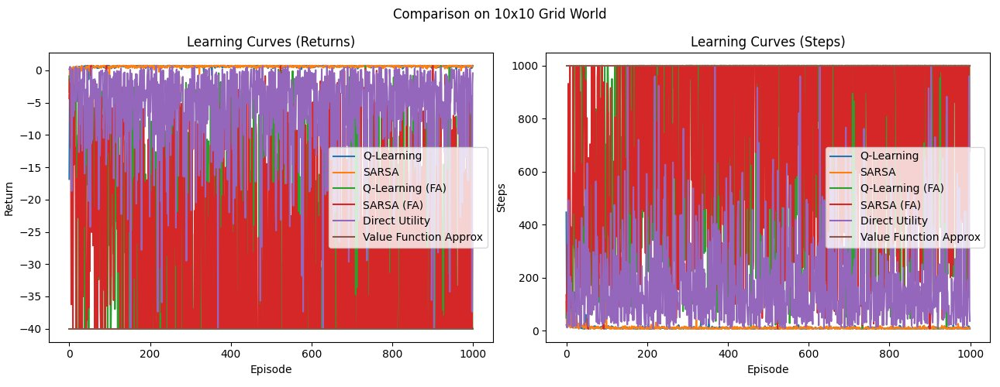

# Reinforcement Learning & MDP Algorithms

Implementation and comparison of classical reinforcement learning and Markov Decision Process algorithms in Python. Tested on Grid World and Wumpus World environments.

---

## Overview

This project implements and benchmarks six algorithms for sequential decision-making under uncertainty:

- **Value Iteration** — exact MDP solver using dynamic programming
- **Modified Policy Iteration** — hybrid of policy evaluation and improvement
- **Q-Learning** — off-policy tabular RL
- **SARSA** — on-policy tabular RL
- **Approximate Q-Learning** — Q-learning with linear function approximation
- **Approximate SARSA** — SARSA with linear function approximation
- **Direct Utility Estimation** — model-free value learning from experience
- **UCB vs ε-Greedy** — multi-armed bandit exploration strategies

---

## Environments

### Grid World
Stochastic grid navigation with slip probability. Tested on:
- 4×3 world (classic textbook layout)
- 10×10 world with varied goal positions

### Wumpus World
Custom MDP with pits, Wumpus agents, gold, and immunity objects. Supports stochastic transitions (80/10/10 move probabilities).

---

## Results

### 4×3 Grid World — Learning Curves


### 10×10 Grid World — Learning Curves


### 10×10 Grid World — Policy Visualization (6 methods)


### Reward Curves — 5×5 Grid


---

## File Structure

```
├── mdp_base.py                  # Abstract MDP base classes
├── wumpus_mdp.py                # Wumpus World MDP implementation
├── wumpus_demo.py               # Wumpus World demo script
├── grid_world.py                # Grid World environment
├── value_iteration.py           # Value Iteration + Modified Policy Iteration
├── rl_agents.py                 # Q-Learning, SARSA, Approx Q-Learning, Approx SARSA
├── direct_utility.py            # Direct Utility + Function Approximation agents
├── comparison.py                # Full 6-method comparison and visualization
├── bandit_simulator.py          # Multi-armed bandit simulator
└── bandit_ucb_vs_epsilon.py     # UCB vs ε-Greedy bandit experiment
```

---

## Key Design Patterns

- `FiniteStateMDP` abstract base class enforces consistent MDP interface across environments
- `TabularAgent` base class shared by Q-Learning and SARSA with epsilon-greedy action selection
- `ApproximateAgent` base class for function approximation methods with shared feature engineering
- All agents support plug-and-play comparison via unified `train_agent` / `compare_agents` interface

---

## Libraries

`numpy` · `matplotlib` · `enum` · `tqdm` · `typing`
