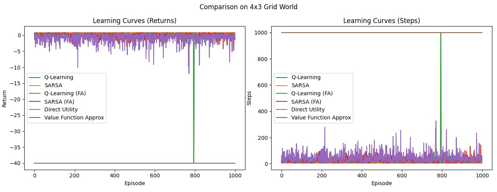
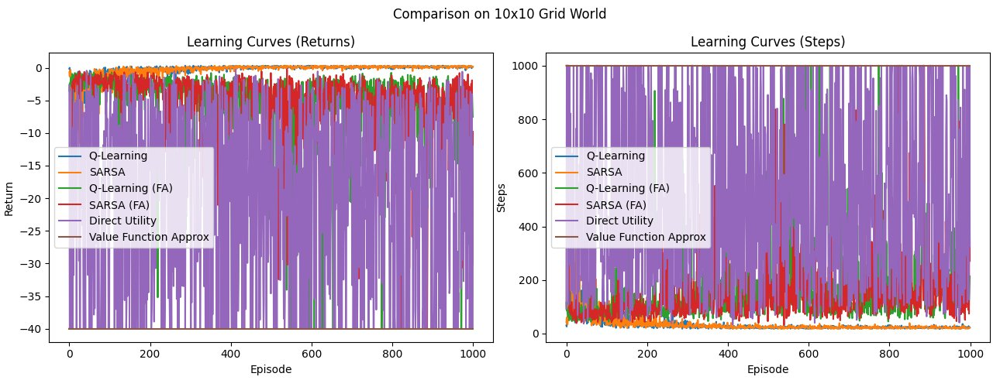
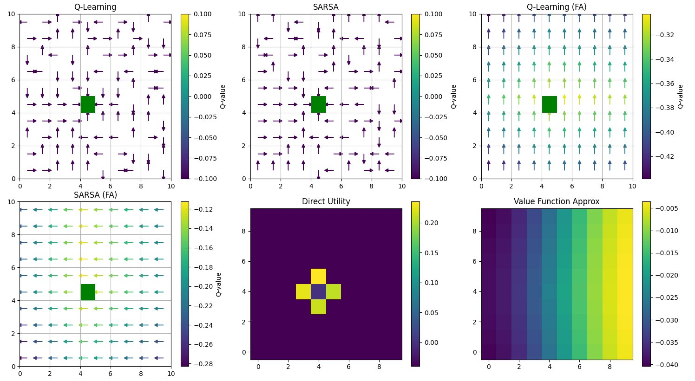

# Analysis Report: Reinforcement Learning & MDP Algorithms

## Overview

This report summarizes experiments comparing classical MDP planning algorithms and reinforcement learning agents across Grid World and Wumpus World environments, as well as a multi-armed bandit study comparing UCB and ε-greedy exploration strategies.

---

## 1. MDP Planning — Value Iteration vs Modified Policy Iteration

### Benchmark Results

| Environment | Value Iteration Time | Modified Policy Iteration Time | Policy Differences |
|-------------|---------------------|-------------------------------|-------------------|
| 4×3 Grid World | 0.045s | 0.036s | 0 |
| Modified Wumpus World | 0.594s | ~0.046s | 0 |

### Key Findings

**4×3 Grid World:**
- Both algorithms converged to identical optimal policies (zero policy divergence)
- MPI marginally outperformed VI in runtime — partial policy evaluation reduced redundant Bellman updates

**Modified Wumpus World:**
- VI showed 13× slower scaling due to large state-space utility propagation
- MPI adapted faster to dynamic reward structures via greedy local policy updates
- Probabilistic pit penalties (-1.0 to -0.23) increased VI's convergence iterations but minimally impacted MPI
- Immunity-gold interactions required iterative Q-value adjustments in VI, while MPI prioritized valid local transitions

**Conclusion:** Value Iteration remains robust for small environments but scales poorly. Modified Policy Iteration is more efficient for large or reward-sensitive environments where rewards are non-uniform and objectives are long-term.

---

## 2. Reinforcement Learning — 6-Method Comparison

Six agents were benchmarked across 4×3 and 10×10 Grid World environments:
- Q-Learning (Tabular)
- SARSA (Tabular)
- Q-Learning with Function Approximation
- SARSA with Function Approximation
- Direct Utility Estimation
- Value Function Approximation

### 4×3 Grid World

Q-Learning and SARSA quickly converged to optimal policies with stable returns and low step counts. Function approximation agents showed instability, and Direct Utility Estimation struggled with consistent convergence.

### 10×10 Grid World

Tabular Q-Learning and SARSA again showed fast convergence and low step counts. Direct Utility Estimation exhibited unstable returns with large variance, while Value Function Approximation failed to learn any meaningful policy and remained stuck at maximum penalty values.

### Policy Visualization — 6 Methods

- **Q-Learning & SARSA (tabular):** Successfully learned optimal paths toward the goal with well-structured Q-values
- **Q-Learning (FA):** Showed some improvement but lacked a fully clear policy
- **SARSA (FA):** Failed to learn a useful strategy — uniform actions across the grid
- **Direct Utility:** Only captured values near the goal, failing to generalize
- **Value Function Approximation:** Values correctly centered around the goal but policy unstable

**Conclusion:** Tabular methods consistently outperform function approximation in these environments. Function approximation requires better feature engineering to work reliably.

---

## 3. Multi-Armed Bandit — UCB vs ε-Greedy

Compared UCB and ε-greedy (ε = 0.1, 0.2, 0.3) across varying numbers of arms (A = 5, 10, 20) and sampling budgets (m = 2, 5, 10).

### Results Summary

| Setting | Best Algorithm | Notes |
|---------|---------------|-------|
| A=5, m=2 | ε-greedy (ε=0.2) | Small action space, limited budget — greedy wins |
| A=5, m=5/10 | ε-greedy (ε=0.1) | UCB closing the gap with more samples |
| A=10, m=2 | ε-greedy (ε=0.1) | UCB unstable in optimal action rate |
| A=10, m=5/10 | UCB | Begins outperforming ε-greedy with larger budget |
| A=20, m=2/5 | UCB | Clear dominance in optimal action selection |
| A=20, m=10 | UCB | Highest fraction of optimal selections, lowest long-term regret |

### Key Findings

- **ε-greedy (ε=0.2)** is most robust in small action spaces with limited sampling budget
- **UCB** becomes increasingly superior as the number of arms grows and sampling budget increases
- With A=20 and sufficient exploration budget, UCB showed clear dominance in both regret minimization and optimal arm selection rate

**Conclusion:** UCB is recommended when the action space is large or when sample efficiency matters. ε-greedy with ε=0.2 is a strong baseline for small, constrained settings.

---

## Summary

| Experiment | Key Result |
|------------|-----------|
| VI vs MPI (4×3) | MPI 20% faster, identical policies |
| VI vs MPI (Wumpus) | MPI 13× faster on large state space |
| Best RL agent (4×3 & 10×10) | Q-Learning and SARSA (tabular) |
| Worst RL agent | Value Function Approximation |
| Best bandit (small A) | ε-greedy (ε=0.2) |
| Best bandit (large A) | UCB |
